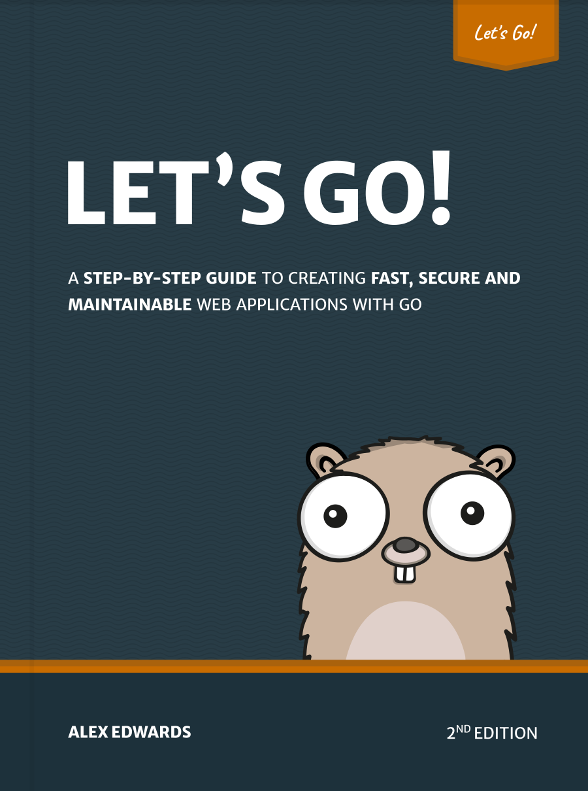

# [lets-go-fa.ir](https://lets-go-fa.ir/)

این کتاب به شما گام‌به‌گام می‌آموزد که چگونه با استفاده از زبان برنامه‌نویسی [Go](https://golang.org/)، برنامه‌های وب سریع، امن و قابل نگهداری ایجاد کنید.

ایده پشت این کتاب کمک به شما برای *یادگیری با انجام دادن* است. ما با هم ساخت یک برنامه وب را از ابتدا تا انتها طی می‌کنیم — از ساختاردهی فضای کاری شما گرفته تا مدیریت نشست (session management)، احراز هویت کاربران (authentication)، امن‌سازی سرور و تست برنامه شما.

ساخت یک برنامه وب کامل به این روش مزایای متعددی دارد. این کار به شما کمک می‌کند تا چیزهایی که یاد می‌گیرید را در بافت مناسب قرار دهید، نشان می‌دهد که بخش‌های مختلف کدبیس شما چگونه به هم متصل می‌شوند، و ما را مجبور می‌کند تا موارد خاص (edge cases) و مشکلاتی که هنگام نوشتن نرم‌افزار در دنیای واقعی پیش می‌آید را حل کنیم. در اصل، شما بیشتر از آنچه که فقط با خواندن مستندات (عالی) Go یا پست‌های وبلاگ مستقل یاد می‌گیرید، یاد خواهید گرفت.

در پایان این کتاب، شما درک و اعتماد به نفس لازم برای ساخت برنامه‌های وب آماده تولید (production-ready) خود را با Go خواهید داشت.

اگرچه می‌توانید این کتاب را از ابتدا تا انتها بخوانید، اما به طور خاص طراحی شده است تا بتوانید همراه با ساخت پروژه، خودتان آن را دنبال کنید.

ویرایشگر متن خود را باز کنید و کدنویسی موفق باشید!

## مطالعه کتاب

[شروع مطالعه آنلاین](https://lets-go-fa.ir/)

## درباره این ترجمه

این ترجمهٔ فارسی کتاب *Let's Go* در واقع همان مسیری است که من برای یادگیری Go طی کردم. می‌خواستم این زبان را یاد بگیرم؛ پس گفتم چرا همزمان با کد زدن و جلو رفتن در کتاب، متن را فارسی نکنم؟ ترجمهٔ اولیه با کمک هوش مصنوعی انجام شد، و بعد خودم هر جمله را یک‌بار دیگر خواندم و هر جایی که لازم بود روان‌ترش کردم.

اگر وسط مطالعه به غلط املایی، اصطلاح نامفهوم، یا جمله‌ای که روان نیست برخوردید، حتماً به من بگویید — از طریق [ایمیل](mailto:razipour1993@gmail.com)، [تلگرام](https://t.me/razipour1993)، یا [لینکدین](https://www.linkedin.com/in/razipour1993).

اگر پس از اتمام این کتاب آمادهٔ قدم بعدی هستید، نسخهٔ فارسی جلد بعدی — [*Let's Go Further*](https://lets-go-further-fa.ir/) — الگوهای پیشرفته‌تر برای APIها و برنامه‌های وب با Go را پوشش می‌دهد.
